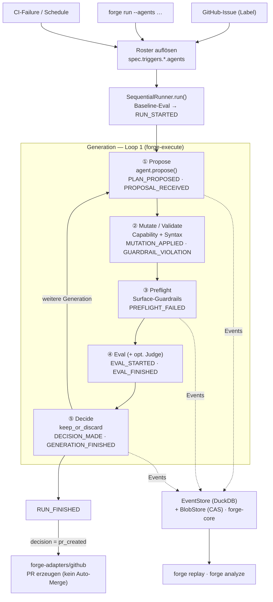
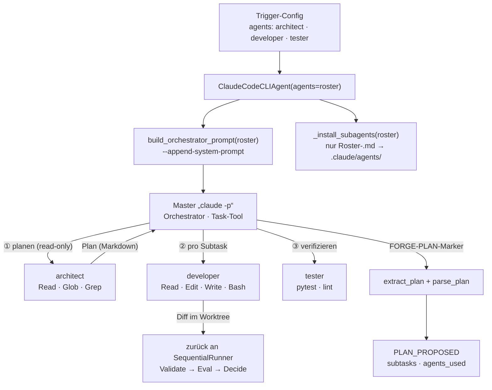

# forge

> **forge ist in v1 eine messbare, replay-fähige Auto-PR-Maschine.**
> Daraus entsteht — wenn die Maschine zuverlässig läuft und genug Daten gesammelt sind — eine Software-Fabrik. Aber nicht umgekehrt.

[]() []()

---

## Was forge tut

forge nimmt einen Trigger (Issue, roter CI-Build, scheduled Optimierungslauf) entgegen, propagiert ihn durch eine Sequenz von **Propose → Mutate → Preflight → Eval → Decide**, und produziert am Ende einen Pull Request. Jeder Schritt emittiert typisierte Events. Die Events sind die einzige Wahrheit, aus der spätere Auswertung — zunächst manuell, später bandit- und BO-gesteuert — Empfehlungen ableitet.

Der Mensch ist Operator: er definiert Ziele, Constraints und Erfolgskriterien. Die Maschine erledigt die Arbeit. Der Mensch reviewt und merged. **Auto-Merge ist in v1 kategorisch ausgeschlossen.**

## Drei Sätze als Mantra

- Nur was messbar ist, darf die Maschine optimieren — und nicht alles Wertvolle ist messbar.
- Jeder Schritt ist ein Event. Ohne Events keine Lernkurve.
- Loop berührt seine eigene Loop-Logik nie. Strikte Schichtung ist Sicherheit.

## Systemüberblick

forge nimmt einen Trigger entgegen, löst aus der `agents:[...]`-Config das Subagent-Roster auf und fährt pro Generation die fünf Phasen. Jede Phase emittiert typisierte Events in den Store (DuckDB + CAS); aus diesen Events speisen sich Replay und Analyse. Entsteht ein verbesserter Stand, erzeugt der GitHub-Adapter einen PR — **nie** ein Auto-Merge.



### Multi-Agent-Orchestrierung (Phase 1 „Propose")

Die Schritt-Choreografie lebt **im `ClaudeCodeCLIAgent`-Plug-in**, nicht im Runner (Mantra 3). Welche Arbeitspferde mitwirken, steuert das Roster aus der Trigger-Config. Der Master-`claude` orchestriert architect → developer → tester via Task-Tool; forge persistiert den Plan als `PLAN_PROPOSED`-Event mit strukturierten Subtasks.



> Ein einsames `agents: [developer]`-Roster überspringt die Orchestrierung (kein Plan, kein Task-Tool) — der klassische Single-Agent-Run.

## Status

| Schritt | Inhalt | Stand |
|---|---|---|
| 1 | Repo-Skeleton (uv-Workspace, 4 Packages) | ✅ |
| 2 | `forge-core` — Events, CAS, DuckDB, Spec, Replay | ✅ |
| 3 | `forge-execute` — Loop 1 mit allen 5 Phasen | ✅ |
| 4 | `forge-cli` + `forge-adapters/github` | ✅ |
| 5 | PINTA-Integration | ⏳ |
| v0.4 | Board-Trigger + Issue-Triage + Auto-Merge-Queue | ✅ |
| v0.5 | LLM-Judge — Verifikation gegen Akzeptanzkriterien (opt-in) | ✅ |

Detailierter Fortschritt: [`docs/progress.md`](docs/progress.md).
Aktuelle Spec: [`docs/forge-spec-v0.5.md`](docs/forge-spec-v0.5.md) (Diff-Doku; ältere Versionen bleiben als Snapshots).

## Packages

| Package | Verantwortung |
|---|---|
| `forge-core` | Event-Schema (18 Kinds), DuckDB-Store, Content-Addressed Blob-Store, `project.yaml`-Loader, Replay-API |
| `forge-execute` | Loop 1 — `SequentialRunner`, Strategies, Mutators, Evaluators, Gates+Scoring, Capabilities, Worktrees, CodingAgent-Protocol |
| `forge-adapters` | Integrationen — GitHub (PR-Erzeugung, Webhook, Action-Templates) |
| `forge-cli` | `forge run`, `forge analyze`, `forge doctor`, `forge replay` |

## Quick start

### Voraussetzungen

- Python ≥ 3.12, [`uv`](https://docs.astral.sh/uv/), Git
- Optional: [Claude Code CLI](https://docs.anthropic.com/en/docs/claude-code), [`gh`](https://cli.github.com/) (für PR-Erzeugung)

### Installation

```bash
git clone <forge-repo>
cd forge
uv sync --all-packages --extra dev
```

### Smoke-Test

```bash
# 1. Tests laufen lassen
uv run pytest                              # 163 Tests, ~40s

# 2. CLI verfügbar?
uv run forge --help

# 3. Health-Check gegen die Beispiel-Spec
uv run forge doctor --spec examples/pinta/.forge/project.yaml
```

### Erster echter Run gegen ein eigenes Repo

```bash
cd /pfad/zu/deinem/repo
mkdir -p .forge
cp /pfad/zu/forge/examples/pinta/.forge/project.yaml .forge/
# project.yaml an dein Projekt anpassen — siehe Spec Teil 5

# Trockenlauf ohne Claude (mit Mock-Agent, schreibt aber Events)
uv run forge run --focus legacy_test_revival --dry-run --max-iterations 3

# Echter Lauf (braucht ANTHROPIC_API_KEY)
export ANTHROPIC_API_KEY=sk-...
uv run forge run --focus legacy_test_revival --max-iterations 3 --create-pr

# Reports
uv run forge analyze
uv run forge replay <run_id>
```

## Binary bauen

Ein eigenständiges `forge`-Binary (kein Python-Setup nötig zum Ausführen)
entsteht via PyInstaller:

```bash
uv run --with pyinstaller python packaging/build_binary.py
# Ergebnis: dist/forge  (Linux/macOS)  bzw.  dist/forge.exe  (Windows)
```

Die CI (`.github/workflows/ci.yml`) baut bei jedem Push die `forge.exe`
auf einem Windows-Runner und lädt sie als Artefakt hoch (`forge-windows-x64`).
Tag-Pushes (`v*`) hängen das Binary zusätzlich an ein GitHub-Release.

## Repo-Layout

```
forge/
├── packages/
│   ├── forge-core/          # Schema, Store, CAS, Spec, Replay
│   ├── forge-execute/       # Loop 1 — Runner, Strategies, Mutators, Evaluators
│   ├── forge-adapters/      # GitHub (PR + Webhooks + Action-Templates)
│   └── forge-cli/           # forge run / analyze / doctor / replay
├── packaging/               # PyInstaller-Entry + reproduzierbarer Binary-Build
├── .github/workflows/       # CI: Test + Lint + forge.exe-Build
├── examples/
│   └── pinta/               # Reference-Spec
├── docs/
│   ├── forge-spec-v0.2.md   # Vollständige Spec
│   ├── progress.md          # M1-Checkliste
│   └── todos.txt            # Original-Implementierungsplan
├── CLAUDE.md                # Architektur-Notizen für Pair-Programming
├── CHANGELOG.md
└── pyproject.toml           # uv-Workspace
```

## Lizenz

TBD — bis Phase 4 (≥100 Runs Daten) keine externen Beiträge.

## Kontakt

Issues / Diskussionen: GitHub. Architektur-Spec ist Vertrag — wenn du etwas vorschlägst, das den Mantra-Sätzen widerspricht, ist es kein Bug, sondern eine Designentscheidung.
