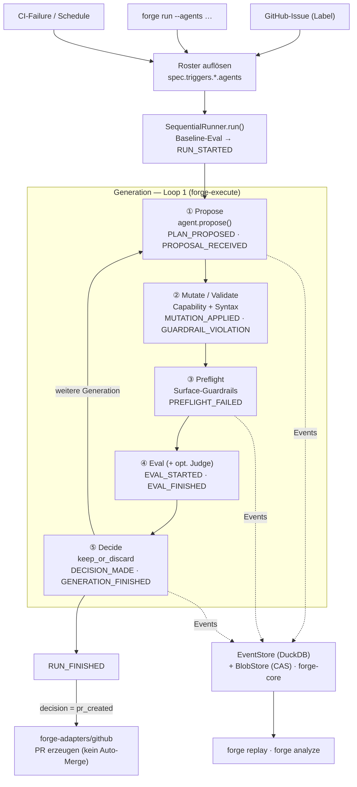
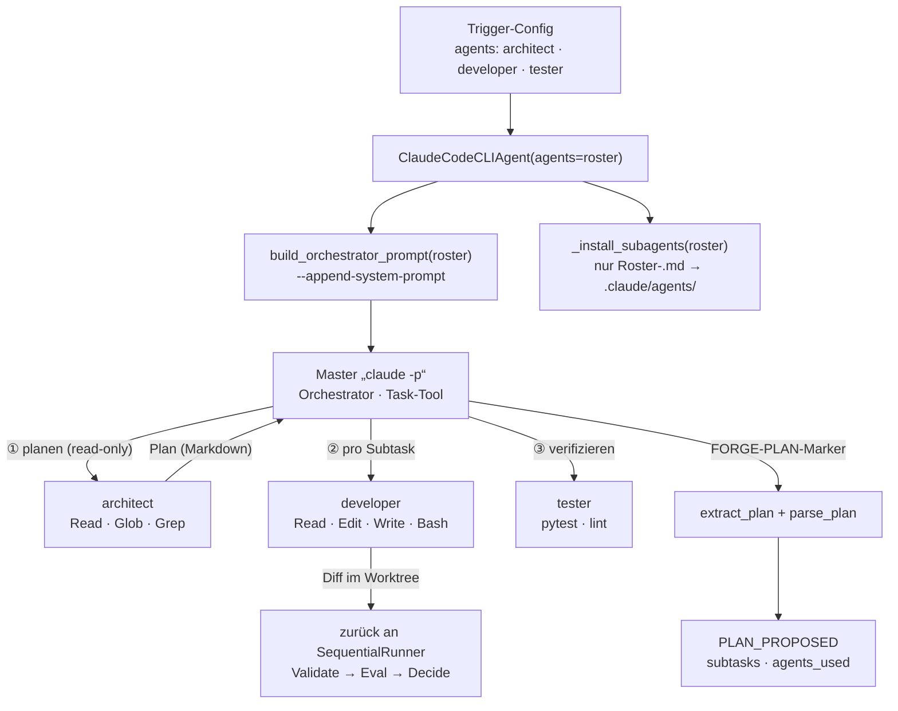

# forge

> **forge ist in v1 eine messbare, replay-fähige Auto-PR-Maschine.**
> Daraus entsteht — wenn die Maschine zuverlässig läuft und genug Daten gesammelt sind — eine Software-Fabrik. Aber nicht umgekehrt.

[]() []()

---

## Was forge tut

forge nimmt einen Trigger (Issue, roter CI-Build, scheduled Optimierungslauf) entgegen, propagiert ihn durch eine Sequenz von **Propose → Mutate → Preflight → Eval → Decide**, und produziert am Ende einen Pull Request. Jeder Schritt emittiert typisierte Events. Die Events sind die einzige Wahrheit, aus der spätere Auswertung — zunächst manuell, später bandit- und BO-gesteuert — Empfehlungen ableitet.

Der Mensch ist Operator: er definiert Ziele, Constraints und Erfolgskriterien. Die Maschine erledigt die Arbeit. Der Mensch reviewt und merged. **Auto-Merge durch forge selbst ist in v1 kategorisch ausgeschlossen.**

> 📖 **Du willst forge *benutzen*?** → [`docs/USER_GUIDE.md`](docs/USER_GUIDE.md)
> 🔧 **Du willst forge *weiterentwickeln*?** → [`CONTRIBUTING.md`](CONTRIBUTING.md) + [`CLAUDE.md`](CLAUDE.md)
> 📜 **Der Vertrag (Spec):** [`docs/forge-spec-v0.6.md`](docs/forge-spec-v0.6.md) (Diff-Doku, ältere Versionen bleiben als Snapshots)

## Drei Sätze als Mantra

- Nur was messbar ist, darf die Maschine optimieren — und nicht alles Wertvolle ist messbar.
- Jeder Schritt ist ein Event. Ohne Events keine Lernkurve.
- Loop berührt seine eigene Loop-Logik nie. Strikte Schichtung ist Sicherheit.

## Systemüberblick

forge nimmt einen Trigger entgegen, löst aus der `agents:[...]`-Config das Subagent-Roster auf und fährt pro Generation die fünf Phasen. Jede Phase emittiert typisierte Events in den Store (DuckDB + CAS); aus diesen Events speisen sich Replay und Analyse. Entsteht ein verbesserter Stand, erzeugt der GitHub-Adapter einen PR — **nie** ein Auto-Merge durch forge.



### Multi-Agent-Orchestrierung (Phase 1 „Propose")

Die Schritt-Choreografie lebt **im `ClaudeCodeCLIAgent`-Plug-in**, nicht im Runner (Mantra 3). Welche Arbeitspferde mitwirken, steuert das Roster aus der Trigger-Config. Der Master-`claude` orchestriert architect → developer → tester (→ optional `/simplify`, reviewer) via Task-/Skill-Tool; forge persistiert den Plan als `PLAN_PROPOSED`-Event mit strukturierten Subtasks.



> Ein einsames `agents: [developer]`-Roster überspringt die Orchestrierung (kein Plan, kein Task-Tool) — der klassische Single-Agent-Run.

### Die Software-Fabrik (Loop 2 — Conductor)

Über den einzelnen Runs liegt der **Conductor** (`forge board-loop --watch --conductor`): eine deterministische Stage-Maschine, die GitHub-Issues durch eine Pipeline taktet und pro Stage das passende Team dispatcht. Mantra 3 bleibt intakt — der Conductor leitet alle Entscheidungen **rein aus dem Event-Strom** ab und greift nie in Runner/Scoring/Gates ein.

```
forge:requirements → forge:design → forge:ready → forge:in-dev → forge:qa → forge:release → forge:done
        │                  │             │            │             │            │
   Akzeptanz-          architect      (wartet)     dev-Loop      review-     tag +
   kriterien           plant                       (PR)          merge       release
        └── (forge:blocked ist von jeder Stage aus erreichbar)
```

Stage-Labels (`forge:<stage>`) sind zugleich die Trigger-Keys. Jeder Conductor-Tick ist ein `ConductorTickCompleted`-Event. Details: [`docs/conductor-design.md`](docs/conductor-design.md).

## Befehle

| Befehl | Zweck |
|---|---|
| `forge init` | Legt ein rudimentäres `.forge/project.yaml` an (idempotent, überschreibt nicht) |
| `forge doctor` | Prüft Spec-Konsistenz, Tool-Verfügbarkeit, API-Key/Auth |
| `forge run` | Ein Sequential-Run gegen ein Issue/einen Prompt (`--multi-agent`, `--agents`, `--create-pr`, `--dry-run`, `--resume`) |
| `forge plan` | Generiert einen Plan (architect-only, **kein** Code) |
| `forge board-loop` | **Fabrik**: zieht ready-Items vom GitHub Project Board und dispatcht sie (`--watch`, `--conductor`, `--max-parallel`, `--auto-merge`) |
| `forge review-pr <N>` | Ein Agent reviewed einen offenen PR und merged ihn opt-in (approve + grüner CI + `capabilities.merge_pr`) |
| `forge watch [RUN_ID]` | Live-Tracking eines laufenden Runs (Worktree-Aktivität + Event-Chronik) |
| `forge analyze` | Markdown-Reports aus dem Event-Store (Merge-Rate, Cost/PR, Lead-Time, Lessons Learned) |
| `forge replay <run_id>` | Rekonstruiert einen Run als lesbare Markdown-Timeline |

Volle Optionen: `forge <command> --help`. Aufgabenorientierte Anleitung: [`docs/USER_GUIDE.md`](docs/USER_GUIDE.md).

## Status

| Schritt | Inhalt | Stand |
|---|---|---|
| 1 | Repo-Skeleton (uv-Workspace, 4 Packages) | ✅ |
| 2 | `forge-core` — Events, CAS, DuckDB, Spec, Replay | ✅ |
| 3 | `forge-execute` — Loop 1 mit allen 5 Phasen | ✅ |
| 4 | `forge-cli` + `forge-adapters/github` | ✅ |
| v0.4 | Board-Trigger + Issue-Triage + Auto-Merge-Queue | ✅ |
| v0.5 | LLM-Judge — Verifikation gegen Akzeptanzkriterien (opt-in) | ✅ |
| v0.6 | Loop-2-Conductor-Pipeline (requirements→done), `/simplify`, reviewer, Session-Resilienz (`--resume`), `review-pr`, Memory/Lessons-Learned, `forge init` | ✅ |

Detaillierter Fortschritt: [`docs/progress.md`](docs/progress.md).

## Packages

| Package | Verantwortung |
|---|---|
| `forge-core` | Event-Schema (**26 Kinds**), DuckDB-Store, Content-Addressed Blob-Store, `project.yaml`-Loader, Replay-API |
| `forge-execute` | Loop 1 — `SequentialRunner`, Strategies, Mutators, Evaluators, Gates+Scoring, Judge, Capabilities, Worktrees, CodingAgent-Protocol |
| `forge-adapters` | Integrationen — GitHub (PR-Erzeugung, Webhook, Project-Board, Action-Templates) |
| `forge-cli` | Die 9 Befehle oben + Loop 2 (Conductor/Heartbeat/board-loop) |

## Quick start

### Voraussetzungen

- Python ≥ 3.12, [`uv`](https://docs.astral.sh/uv/), Git
- Optional: [Claude Code CLI](https://docs.anthropic.com/en/docs/claude-code) (für echte Runs), [`gh`](https://cli.github.com/) (für PR-Erzeugung)
- Auth: entweder `claude /login` (Subscription) **oder** `ANTHROPIC_API_KEY` in der Env

### Installation

```bash
git clone <forge-repo>
cd forge
uv sync --all-packages --extra dev
```

### forge global installieren (in jedem Repo aufrufbar)

Damit `forge` als Befehl in **jedem** Repository verfügbar ist — nicht nur via `uv run` im forge-Workspace — gibt es einen Installer. Er baut die vier Workspace-Wheels und installiert sie via `uv tool install` auf die PATH.

```powershell
# Windows (PowerShell)
pwsh scripts/install.ps1
```

```bash
# Linux / macOS
scripts/install.sh
```

Danach (ggf. neue Shell öffnen) aus einem beliebigen Repo: `forge --help`. Erneutes Ausführen aktualisiert (idempotent). Deinstallieren: `pwsh scripts/install.ps1 -Uninstall` bzw. `scripts/install.sh --uninstall`.

> **Hinweis zur PyPI-Namenskollision:** Die Distributionsnamen `forge-cli`, `forge-core` und `forge-adapters` sind auf PyPI von fremden Paketen belegt. Der Installer installiert die lokalen Wheels deshalb **per Dateipfad** (gepinnte Referenzen, die jede Index-Version überschreiben) — ein Install per Name würde die falschen Pakete ziehen.

### Smoke-Test

```bash
uv run pytest                              # ~571 Tests
uv run forge --help
uv run forge doctor --spec examples/pinta/.forge/project.yaml
```

### Erster echter Run gegen ein eigenes Repo

```bash
cd /pfad/zu/deinem/repo

# 1. Rudimentäre Config anlegen und an dein Projekt anpassen (siehe USER_GUIDE)
forge init
forge doctor --spec .forge/project.yaml

# 2. Trockenlauf ohne Claude (Mock-Agent, schreibt Events, $0)
forge run --prompt "Fixe den failing test in tests/test_foo.py" --dry-run

# 3. Echter Lauf (braucht claude-Auth)
forge run --prompt "…" --multi-agent --model sonnet --create-pr

# 4. Beobachten / auswerten
forge watch                 # Live-Panel des laufenden Runs
forge analyze               # KPIs über alle Runs
forge replay <run_id>       # Timeline eines Runs
```

> ⚠️ **Greenfield-Falle (rot→grün):** Bei leeren `scores` und bereits grüner Baseline verwirft forge eine neue (ebenfalls grüne) Generation als `no_improvement`. Ein **neues** Feature wird nur behalten, wenn ein Gate von **rot auf grün** springt — also einen vorab geschriebenen, fehlschlagenden Akzeptanztest grün macht (oder per opt-in LLM-Judge, siehe Spec v0.5). Details: [`docs/USER_GUIDE.md`](docs/USER_GUIDE.md) (Abschnitt „Features bauen — die rot→grün-Regel").

## Binary bauen

```bash
uv run --with pyinstaller python packaging/build_binary.py
# Ergebnis: dist/forge  (Linux/macOS)  bzw.  dist/forge.exe  (Windows)
```

Die CI (`.github/workflows/ci.yml`) baut bei jedem Push die `forge.exe` auf einem Windows-Runner und lädt sie als Artefakt hoch. Tag-Pushes (`v*`) hängen das Binary an ein GitHub-Release.

## Repo-Layout

```
forge/
├── packages/
│   ├── forge-core/          # Schema, Store, CAS, Spec, Replay
│   ├── forge-execute/       # Loop 1 — Runner, Strategies, Mutators, Evaluators, Judge
│   ├── forge-adapters/      # GitHub (PR + Webhooks + Project-Board + Action-Templates)
│   └── forge-cli/           # 9 Befehle + Loop 2 (Conductor/Heartbeat/board-loop)
├── packaging/               # PyInstaller-Entry + reproduzierbarer Binary-Build
├── scripts/                 # install.ps1 / install.sh — forge global auf die PATH
├── .github/workflows/       # CI: Test + Lint + forge.exe-Build
├── examples/pinta/          # Reference-Spec
├── docs/
│   ├── USER_GUIDE.md        # Anleitung für Anwender
│   ├── forge-spec-v0.6.md   # Aktuelle Spec (Diff-Doku)
│   ├── conductor-design.md  # Loop-2-Design
│   └── progress.md          # Fortschritt
├── CONTRIBUTING.md          # Anleitung für Entwickler (inkl. forge-on-forge)
├── CLAUDE.md                # Architektur-Notizen / Konventionen
├── CHANGELOG.md
└── pyproject.toml           # uv-Workspace
```

## Lizenz

TBD — bis Phase 4 (≥100 Runs Daten) keine externen Beiträge.

## Kontakt

Issues / Diskussionen: GitHub. Architektur-Spec ist Vertrag — wenn du etwas vorschlägst, das den Mantra-Sätzen widerspricht, ist es kein Bug, sondern eine Designentscheidung.
